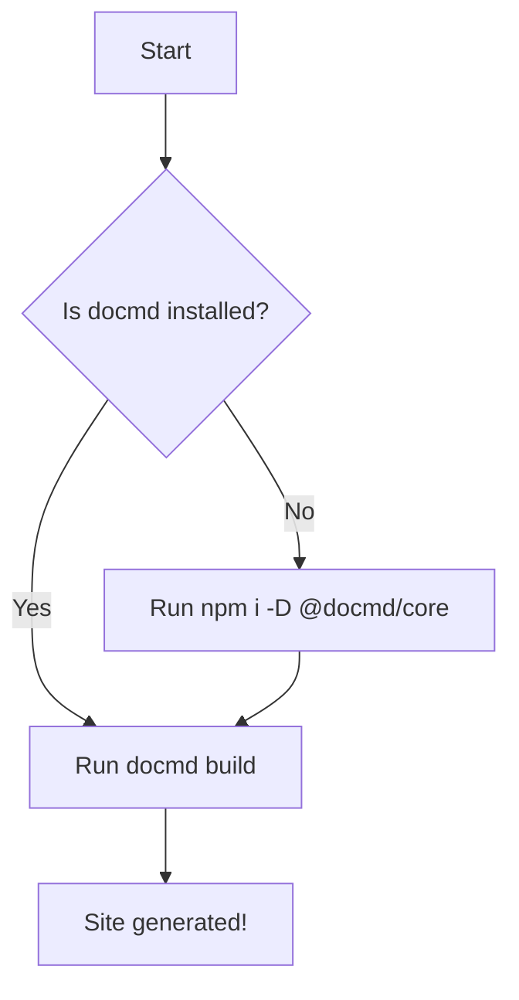
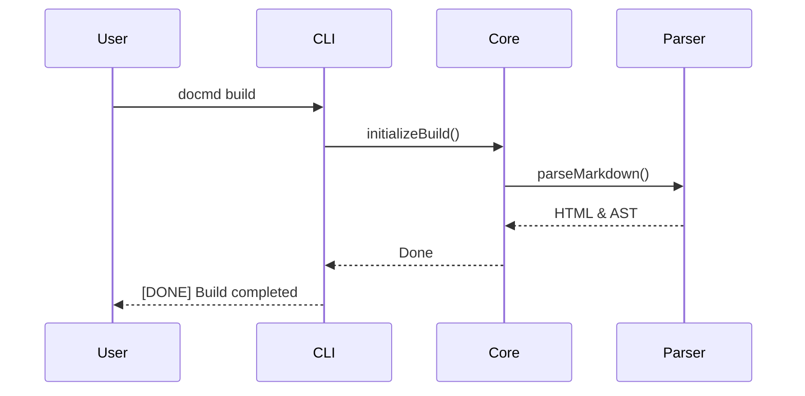

# Mermaid Diagrams

This page tests the rendering of Mermaid flowcharts and sequence diagrams.

## Flowchart

```mermaid
graph TD
    A[Start] --> B{Is docmd installed?}
    B -- Yes --> C[Run docmd build]
    B -- No --> D[Run npm i -D @docmd/core]
    D --> C
    C --> E[Site generated!]
```

## Sequence Diagram

```mermaid
sequenceDiagram
    participant User
    participant CLI
    participant Core
    participant Parser

    User->>CLI: docmd build
    CLI->>Core: initializeBuild()
    Core->>Parser: parseMarkdown()
    Parser-->>Core: HTML & AST
    Core-->>CLI: Done
    CLI-->>User: [DONE] Build completed
```
