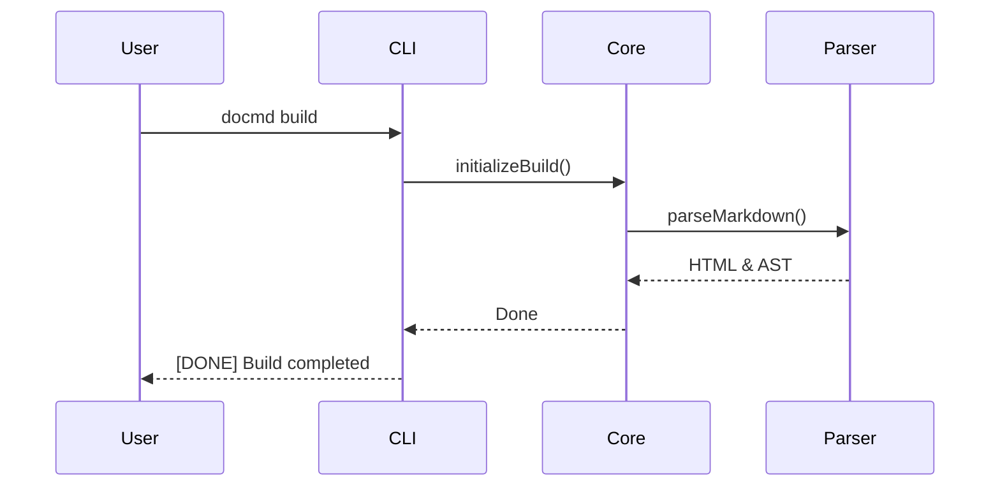

# Mermaid Diagrams Test Suite

This page tests both the standard GFM code block fallback and the modern `::: mermaid` container UI shell in `docmd` v0.9.1.

---

## 1. Modern `::: mermaid` Container UI Shell

This diagram uses the `::: mermaid` container with explicit attributes: `title`, `icon`, `align:center`, `zoom:true`, `theme:forest`, and trailing `# comments`.

::: mermaid title:"Architecture Overview" icon:layers align:center zoom:true theme:forest # Container header comment
graph TD
    Client[Web Client] --> API[docmd API]
    API --> Parser[docmd Parser]
    API --> Engine[docmd Engine]
    Parser --> SVG[Rendered SVG Diagram]
::: /mermaid # Container closing comment

---

## 2. Standard GFM Code Block Fallback

Standard ` ```mermaid ` code blocks inherit global default options from `docmd.config.json`.


